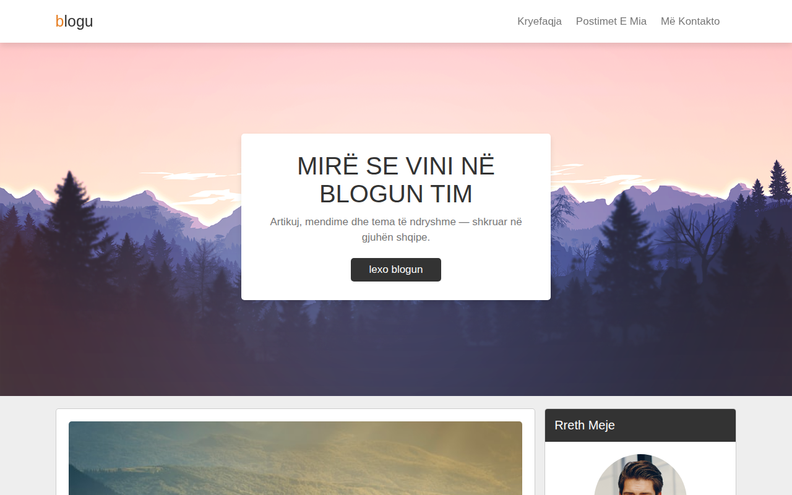

# Blog — Erion Nezha

Blog personal modern në gjuhën shqipe — artikuj, kategori dhe seksion kontakti.

**Demo live:** https://erionnezha.github.io/Blog-Website/



## Përshkrimi

Një faqe blogu elegante dhe e thjeshtë në përdorim, e përshtatur plotësisht në gjuhën shqipe. Faqja përfshin:

- **Kryefaqe** me baner mirëseardhjeje
- **Postime** — artikuj shembull me datë publikimi, titull dhe përmbajtje
- **Shirit anësor** — rreth autorit, kategoritë, postimet e fundit dhe etiketat
- **Kontakt** — formular kontakti me të dhënat e autorit
- Kërkim në faqe dhe menu e përshtatshme për celular

## Si hapet lokalisht

1. Shkarko ose klono këtë repo:
   ```bash
   git clone https://github.com/ErionNezha/Blog-Website.git
   ```
2. Hape skedarin `index.html` në shfletuesin tënd — nuk kërkohet server.

## Teknologjitë

- HTML5
- CSS3
- JavaScript
- Font Awesome (ikona)

## Licenca

Ky projekt është i licencuar nën licencën MIT — shiko skedarin [LICENSE](LICENSE) për detaje.

---

# Blog — Erion Nezha

A modern personal blog in Albanian — articles, categories and a contact section.

**Live demo:** https://erionnezha.github.io/Blog-Website/


## Description

An elegant, easy-to-use blog page, fully localized in Albanian. It includes:

- **Hero banner** with a welcome message
- **Posts** — sample articles with publish date, title and content
- **Sidebar** — about the author, categories, recent posts and tags
- **Contact** — contact form with the author's details
- On-page search and a mobile-friendly menu

## Run locally

1. Download or clone this repo:
   ```bash
   git clone https://github.com/ErionNezha/Blog-Website.git
   ```
2. Open `index.html` in your browser — no server required.

## Technologies

- HTML5
- CSS3
- JavaScript
- Font Awesome (icons)

## License

This project is licensed under the MIT License — see the [LICENSE](LICENSE) file for details.
